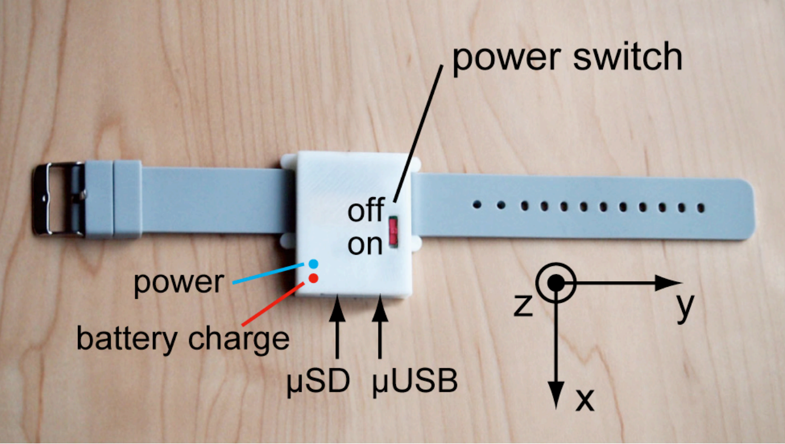

# Otonoko
Interactive wearable MIDI Sound device.

## Motion Tracking Device
We made Motion Trackin Device for Health, Sport, Entertainment etc...
- Device has 10-dim sensors(3-dim acceleration, 3-dim gyro, 3-dim magnetic and temperature).

## Analysis and Transduction Software
We made Analysis and Tranducing Software with Windows API(MFC).
- Software display Virtual Motion with OpenGL.
- Software transduce sensor data to CG Motion and Sound Effect.
